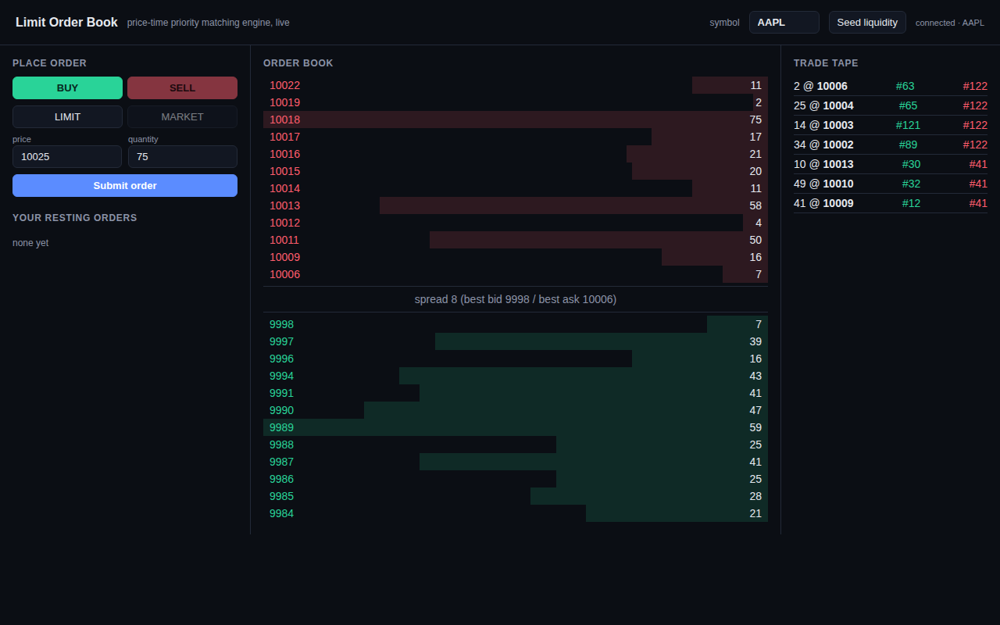

# Limit Order Book / Matching Engine

A price-time priority limit order matching engine in C++17 — the same
matching model real exchanges use. Supports limit orders, market orders
(IOC), and cancels; multi-symbol and thread-safe, sharded by symbol so
different symbols never contend on the same lock. Ships with unit tests
and a throughput/latency benchmark.



For the full design writeup — data structure rationale, matching
algorithm, concurrency model, benchmarks, and interview talking points —
see the [field notes](https://claude.ai/code/artifact/ca21d6c0-000f-4606-a040-374babf57a35).

## Running it

```sh
cmake -S . -B build -DCMAKE_BUILD_TYPE=Release
cmake --build build -j"$(nproc)"
cd build && ctest --output-on-failure && cd ..   # unit tests
./build/lob_demo                                 # interactive terminal REPL
./build/lob_server 8080                          # web UI: http://localhost:8080
./build/lob_bench [orders] [threads] [orders_per_thread]  # benchmark
```

Requires a C++17 compiler, CMake 3.16+, and threading support (pthreads
on Linux/macOS). No third-party dependencies.

(If your `ctest` predates CMake 3.20, it doesn't understand `--test-dir`
and will silently report every test "Not Run" — `cd build` first, as
above, works on any version.)
